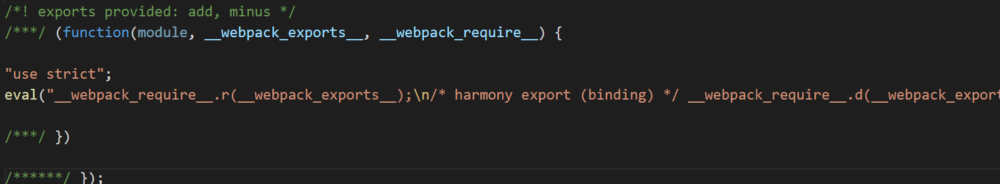

# webpack高级概念

## Tree Shaking

举例说明Tree Shaking的作用。

资料：[Tree shaking](https://webpack.js.org/guides/tree-shaking/#root)

`math.js`

```js
export const add = (a,b) => {
    console.log(a+b)
}

export const minus = (a,b) => {
    console.log(a-b)
}
```

`index.js`

```js
import { add } from './math'

add(1,2)
```

运行`yarn build`打包后生成bundle.js,webpack打包将math.js中的add、minus方法都进行了打包，但是我们只在index.js中引入了add方法，最理想的是只对引入的add方法进行打包，而未使用的其他方法或模块应该不被打包进去。



那么如何实现这种理想状态呢？

通过`Tree Shaking`来解决。一个模块可以理解成一个树，这个模块可以导出很多内容，这些内容可以理解成一个小的树形结构。当只引入树的一部分，而只对引入的部分做打包，未引入的部分不做打包处理（不引入的部分剔除掉，摇晃掉）。

### 如何实现Tree Shaking

`Tree Shaking`只支持ES Module。也就是只支持import的引入方式,不支持require的方式引入。ES Module的引入的底层是静态的引入方式，而commonjs是动态的引入方式。`Tree Shaking`只支持这种静态的引入方式。

当mode为development的模式时，默认是没有`Tree Shaking`这个功能。

在webpack.config.js中配置:

```js
 optimization: {
      usedExports: true
  }
```

接着在package.json中配置：

```js
{
  "name": "demo06",
  "sideEffects": false,
}
```

`sideEffects`的作用是对某个引入的文件或模块不做`Tree Shaking`处理。当设置为false时是没有不做`Tree Shaking`处理的代码。

```js
//举例子：
{
  "name": "demo06",
  //此时`Tree Shaking`对@babel/polly-fill没有作用。
  "sideEffects": ["@babel/polly-fill"],
}
```

一般不对css文件做`Tree Shaking`。

```js
//举例子：
{
  "name": "demo06",
  //此时`Tree Shaking`对css文件没有作用。
  "sideEffects": [
      "*.css"
  ],
}
```

做了以上处理后，再执行打包的命令`yarn build`：


这时仍然对未引入的模块进行了打包处理，但是此时webpack已经知道只对add模块做了引入使用（如上图红框标记）。这时是因为此时的mode为`development`（开发模式），这是为了我们在做开发时方便做调试，防止了source-map工具的映射出错，所以会保留未引入模块的代码。

当把mode改为`production`模式，打包上线的情况（生产环境）。

当mode为`production`时，其实这个模式下，`Tree Shaking`的配置其实已经自动的写好了，不需要再做上面的配置，`sideEffects`仍然需要写一下。

执行压缩打包命令`yarn build`后：


这时minus方法就没有引入了，就只是对引入使用的add方法做了打包处理。


## Development和Production模式的区分打包

在项目的开发过程中，有developent模式与Production模式，在开发过程中一般使用development模式


当源代码要上线时，这时要采用Production模式，在线上环境的source Map可以简洁写，代码需要压缩。

由之前在Tree Shaking那一节得，当我们需要切换环境时，要对`webpack.config.js`作修改，这种方式的修改是很不方便的。

我们可以采取如下方式解决：

对`webpack.config.js`做重命名，

一个取名为`webpack.dev.js`,一个取名为`webpack.prod.js`。

通过在不同的文件中写不同的配置，从而达到我们想要的效果，那么如何指定打包的代码是线上环境的还是开发环境上的呢？这时我们可以通过指定不同命令的方式来进行打包，通过`--config `来指定使用那个配置文件。

在package.json中做如下配置（命令的启动方式）：

```js
"scripts": {
    "dev": "webpack-dev-server --config webpack.dev.js",
     
    "build":"webpack --config webpack.prod.js"
 },
```

通过`yarn build`命令打包的文件是线上的文件。

通过`yarn dev`命令运行的是一个devServer的开发环境，并不会生成一个dist目录。

通过这种分开的方式写，他们之间其实会存在许多相同的代码，这显然也不是很理想的效果，这时候我们可以再提取一个`webpack.common.js`文件来将它们相同的代码写在这个文件中，然后实现共用。如何实现这几个文件的关联性呢？

这时就需要引入第三方插件。

```bash
npm install webpack-merge -D

yarn add webpack-merge --dev
```

`webpack.dev.js`

```js

const webpack = require('webpack')
const merge = require('webpack-merge')
const commonConfig = require('./webpack.common.js')

const devConfig = {
    mode:'development',  //打包的文件不会被压缩
    devtool:'cheap-module-eval-source-map',
    devServer:{
      //指定根路径,服务器启动需要运行的目录文件
      contentBase: './dist',
      //在启动webpck-dever-sever时，会自动的打开浏览器
      open: true,
      //开启hot module Replacement
      hot: true,
      //html失效时，不需要重新刷新页面
      hotOnly: true
    },
    plugins:[
      new webpack.HotModuleReplacementPlugin()
    ],
  optimization: {
      usedExports: true
  }, 
  }

  module.exports = merge(commonConfig,devConfig)
```

`webpack.prod.js`

```js
const merge = require('webpack-merge')
const commonConfig = require('./webpack.common.js')

const prodConfig = {
    //入口文件
    mode:'production',
    devtool:'cheap-module-source-map',
}

module.exports = merge(commonConfig,prodConfig)
```


`webpack.common.js`

```js

const path = require('path')
const HtmlWebpackPlugin = require('html-webpack-plugin');
const { CleanWebpackPlugin } = require('clean-webpack-plugin')

module.exports = {
    entry:{
        main:'./src/index.js',
       // main:["@babel/polyfill", './src/index.js']
   },
   module: {
    rules: [
      { 
        test: /\.js$/, 
        //node_modules实际是第三发代码，没必要对其进行babel转化，将其排除在外。
        exclude: /node_modules/,
         loader: "babel-loader" 
      },
      {
        test: /\.css$/,
        use: [
          {
            loader:'style-loader',
          },
          {
            loader: 'css-loader',
            options: {
              importLoaders: 1,
              modules: true //开启模块化打包
            }
          },
         {
           loader:'postcss-loader'
         }  
        ]
      }
    ]
  },
  output:{
    publicPath: './',
    //打包后的文件名
    filename: 'bundle.js',
    //指定存为位置
    path: path.resolve(__dirname,'dist')
},
  plugins:[
    new HtmlWebpackPlugin({
      template:'src/index.html'//以某个html文件为模板生成。
}),
    new CleanWebpackPlugin(),
]

}
```


## Webpack和 Code Splitting

举例子说明Code Splitiing。

安装loadsh

```bash
npm install loadsh --save

yarn add loadsh
```

index.js

```js
import _ from "loadsh" //1MB

//业务逻辑 1mb
console.log(_.join(['a','b','c'],'***'))

//此处省略1万行代码
console.log(_.join(['a','b','c'],'***'))

//main.js 2mb 打包的文件

//打包文件会很大，加载时间会长

//main.js 2mb

//重新访问页面时，又要加载2mb的内容
```

当打包文件的很大时，访问页面的加载时间会很长

当重新访问页面时，又要加载2mb的内容，访问时间仍然很长。

那么如何解决这种问题呢？

### 第一种方式

`loadsh.js`

```js
import _ from "loadsh" //1MB

window._ = _
```

index.js

```js

//业务逻辑 1mb
console.log(_.join(['a','b','c'],'***'))

//此处省略1万行代码
console.log(_.join(['a','b','c'],'***'))
```

通过做代码的分割来解决。使得main.js被拆成loadsh.js(1mb),main.js(1mb)。

当页面业务逻辑发生变化时，只要加载main.js即可。（1mb）

对`webpack.config.js`不同的入口文件做打包进行代码的分割。

```js
   entry:{
        loadsh:'./src/loadsh.js',
        main:'./src/index.js',
   },
```

这种方式可以在第二次加载时，只是在main.js业务逻辑变化，重新加载，而loadsh.js未修改，就不会重新加载。

===>这种代码的拆分就是Code Spliting,这种方式是我们自己动手做拆分。

那么如何智能的做代码的拆分呢？

### 第二种方式

通过 [`SplitChunksPlugin`](https://webpack.js.org/plugins/split-chunks-plugin/) 来做Code Splitting

```js
//做代码分割。
   optimization: {
     splitChunks: {
       chunks: 'all',
     },
  },
```

打包后dist文件夹的目录如下（红色部分为新增的）：


这里红色标记的框是对loadsh的代码进行了打包，通过这种方式webpack自动的对代码进行分割。

### 第三种方式

还可以通过其他的方式进行代码的分割（无需做配置）。方法如下：

例子：

`index.js`

```js
function getComponent() {
    return import('loadsh').then(({default:_})=>{
        let element =document.createElement('div')

        element.innerHTML = _.join(['Dell','lee','-'])

        return element
    })
}

getComponent().then(el => {
    document.body.appendChild(el)
})
```

打包结果：


loadsh模块的代码被打包成了0.js，webpack会自动对这种异步的代码进行代码分割，分别进行打包。这种方式不需要其他的配置。

[Code Splitting]( https://webpack.js.org/guides/code-splitting/ )


## SplitChunksPlugin 配置参数详解

### 安装魔法注释

通过这个注释可以更好的我们的打包文件重命名.

```bash
npm install --save-dev @babel/plugin-syntax-dynamic-import

yarn add @babel/plugin-syntax-dynamic-import --dev
```

`.babelrc`

```js
{
    "presets": [
        [
            "@babel/preset-env",{
             "targets": {
             "chrome": "67"           
            },             
            },
        ],
        
        "@babel/preset-react"
     ],
     "plugins": ["@babel/plugin-syntax-dynamic-import"]
}
```


`index.js`

```js
function getComponent() {
    //魔法注释,对打包的文件的名字命名为loadsh
    return import(/*webpackChunkName:"loadsh"*/'loadsh').then(({default:_})=>{
        let element =document.createElement('div')

        element.innerHTML = _.join(['Dell','lee','-'])

        return element
    })
}

getComponent().then(el => {
    document.body.appendChild(el)
})
```

运行`yarn dev-build`后：


0.js的loadsh打包文件重命名为红色框的名字。

如果想要打包的文件为`loadsh`的名字则可以做如下配置:

`webpack.config.js`

```js
 optimization: {
     splitChunks: {
       chunks: 'all',
       cacheGroups: {   
          vendors:false,
          default: false
      }
     },
  },
```

这时候再运行打包的命令后:


### 配置参数说明

做代码分割的参数说明(optimization中splitChunks里面的参数):

chunks说明:

- 当`chunks:"async"`做代码分割时只对异步代码生效
- 当`chunks:"initial"`做代码分割时只对同步代码生效
- 当`chunks:"all"`对同步代码和异步代码一起做分割

minSize: 30000

引入的库的大小大于30000字节时,就做代码的分割,如果不大于就不做代码分割.

注意:对引入的库,当 default: false时，不会生成打包的文件，这是因为打包的文件存放位置不知道放哪儿，所以不会生成。当不为false且default中的minChunks小于2时，就会对引入模块进行打包放在default~main.js中.

minChunks: 1,

- 当一个模块被引入的次数大于1，就做代码分割，否则不做代码分割

```js
//做代码分割。
   optimization: { 
     splitChunks: {
       //做代码分割时只对异步代码生效
      chunks: "all",

      //引入的库的大小大于30000字节(30kb)时,就做代码的分割,如果不大于就不做代码分割.
      // minSize: 30000,
      minSize: 0, //当 default: false时，不会生成打包的文件，这是因为打包的文件存放位置不知道放哪儿，所以不会生成。当不为false且default中的minChunks小于2时，就会对引入模块进行打包放在default~main.js中
      
      //当一个模块被引入的次数大于1，就做代码分割，否则不做代码分割
      minChunks: 1,

      //一个页面同时只能加载五个模块数，超过五个就不做代码的分割了
      maxAsyncRequests: 5,

      //整个网站首页（入口文件）进行加载的时候，引入的库最多只能做3个分割的js文件。
      maxInitialRequests: 3,

      //默认未定义名字时，对cacheGroups组下的组名加上~的分割符+入口文件名.js
      automaticNameDelimiter: '~',
      //使得自定义名字有效
      name: true,
      //缓存组，对同步的代码做代码分割（可以针对不同的规则来打包相应进组里）
      cacheGroups: {
         //vendors组
        vendors: {
          //检测引入的库是否是在node_modules下，如果是就符合vendors的要求，默认打包后生成的文件就以vodors~开头的文件（vendors~main）。
          test: /[\\/]node_modules[\\/]/,
          // 打包的内容放那个组下的优先级，值越大优先级越高。这里vendors组优先级大于default组。
          priority: -10,
          //也可以对符合要求的模块代码打包的名字自定义
          filename: 'vendors.js'
        },

        //当 default: false时，不会生成打包的文件，这是因为打包的文件存放位置不知道放哪儿，所以不会生成。当不为false且default中的minChunks小于2时，就会对引入模块进行打包放在default~main.js中
        default: {
          minChunks: 1,
          priority: -20,
          //它会判断之前打包模块时是否打包过，如果已经被打包过，则忽略这个模块。如果没有打包过，就对该模块进行打包处理。
          reuseExistingChunk: true,
          //自定义打包后的打包文件名称
          filename: 'common.js'
        }
      }
    }
  }
```

资料:

[split-chunks-plugin]( https://www.webpackjs.com/plugins/split-chunks-plugin/ )


## Lazy Loading 懒加载，Chunk 是什么？

### 懒加载

使用异步代码可以做懒加载，指的是import方式实现懒加载。

举例子：

`index.js`

```js
//使用异步代码可以做懒加载
function getComponent() {
    return import(/*webpackChunkName:"loadsh"*/'loadsh').then(({default:_})=>{
        let element =document.createElement('div')

        element.innerHTML = _.join(['Dell','lee','-'])

        return element
    })
}
//只有当使用时，这些异步的代码才加载。==》所以说是一个懒加载。
document.addEventListener('click',()=>{
    getComponent().then(el => {
        document.body.appendChild(el)
    })
})
```

在`index.js`中使用了异步的方式去编写代码。执行打包命令后：


然后运行dist目录下的index.html后，发现只加载了三个文件：


当触发点击事件后才加载打包的`loadsh.js`文件。


这说明使用异步代码的编写方式可以实现懒加载的效果。这里是通过impor异步去加载一个模块，只有当引入的模块使用时，对应的模块才会去加载使用。

通过懒加载的方式可以使得页面加载速度更快。

简化`index.js`代码：

```js
//使用异步代码可以做懒加载
async function getComponent() {
   const{default:_} = await import(/*webpackChunkName:"loadsh"*/'loadsh')

    let element =document.createElement('div')

    element.innerHTML = _.join(['Dell','lee','-'])

    return element
}
//只有当使用时，这些异步的代码才加载。==》所以说是一个懒加载。
document.addEventListener('click',()=>{
    getComponent().then(el => {
        document.body.appendChild(el)
    })
})
```


### chunk是什么

打包后做代码分割后生成的多个js文件，每个js文件就是一个chunk。如下：有三个chunk。


webpack.config.js中的minChunks含义：

```js
optimization: { 
   splitChunks: { 
//如果有两个以上的chunk文件依赖于某个模块，就做代码分割。不满足就不做代码分割。
     minChunks: 2,
   }
}
```


## 打包分析

当我们使用webpack进行代码的打包之后，借助打包分析的工具来对我们打包的文件进行分析。

 https://github.com/webpack/analyse 

`webpack.config.js`

```js
 "scripts": {
   
    "dev-build": "webpack webpack --profile --json > stats.json --config ./build/webpack.dev.js",
  },
```

在打包的过程中将打包过程中的描述放入`stats.json`文件中。运行`yarn dev-build`后会在根目录下生成一个stats.json文件：


其实该文件就是对整个打包过程进行描述的文件。

然后可以点击进入[analyse]( http://webpack.github.com/analyse )上传我们的stats.json文件对其进行分析。分析结果入下：


assets：指的是静态资源。

还有其他的工具对webpack打包的代码进行分析。

[其他打包工具](https://webpack.js.org/guides/code-splitting/#bundle-analysis)


## Preloading和Prefetching

如果希望第一次访问的页面加载速度很快，那么如何实现？

应该从代码的使用率来提升。（异步代码的编写方式）

在控制台`Ctrl+Shift+P`


## 

举例子（未使用Prefetcing和Preloading时）：

`click.js`

```js
function handleClick() {
    const element = document.createElement('div')
    element.innerHTML = 'Dell Lee'
    document.body.appendChild(element)
}

export default handleClick
```

`index.js`

```js
document.addEventListener('click',()=>{
    import('./click.js').then(({default:func})=>{
        func()
    })
})
```

运行打包命令后：


控制台未点击页面之前：


点击页面之后：


当点击后才加载这个框的代码，这个点击交互反应会很慢。（例如上面的点击页面时才加载0.js）


当页面加载完，网络空闲时去加载这个框的代码，就不会出现点击加载反应慢的问题。

这种方式如何实现呢？

[Prefetching和Preloading]( https://webpack.js.org/guides/code-splitting/#prefetchingpreloading-modules )

由之前的魔法注释的方式引入模块。


### Prefetching

使用`Prefetching`

`index.js`

```js
document.addEventListener('click',()=>{
    import(/* webpackPrefetch: true */'./click.js').then(({default:func})=>{
        func()
    })
})
```

通过这种方式可以很好的利用浏览器的缓存,这种方式可以在网络空闲时去加载引入的文件或模块（这里的例子中是打包后的0.js）:


点击后加载：


由于之前已经提前加载好了，这里是利用了浏览器的缓存，所以会再加载一次的时间会小很多。

### Preloading

未使用Preloading之前：


使用Preloading。

`index.js`

```js
document.addEventListener('click',()=>{
    import(/* webpackPreload: true */'./click.js').then(({default:func})=>{
        func()
    })
})
```

打包后：

未点击前：


点击后：


这种方式不推荐，使用Prefetching的效果会更好一点。

在做前端代码性能优化上，缓存并不是最重要的点，而是代码使用率上的思考。


## CSS文件的代码分割

### MiniCssExtractPlugin

使用[MiniCssExtractPlugin]( https://webpack.js.org/plugins/mini-css-extract-plugin/#root )插件来对CSS代码进行分割。

安装:

```bash
npm install --save-dev mini-css-extract-plugin

yarn add mini-css-extract-plugin --dev
```

`webpack.config.js`

```js
const MiniCssExtractPlugin = require('mini-css-extract-plugin');
module.exports = {
  plugins: [
    new MiniCssExtractPlugin({
      // Options similar to the same options in webpackOptions.output
      // all options are optional
      filename: '[name].css',
      chunkFilename: '[id].css',
      ignoreOrder: false, // Enable to remove warnings about conflicting order
    }),
  ],
  module: {
    rules: [
      {
        test: /\.css$/,
        use: [
          {
            loader: MiniCssExtractPlugin.loader,
            options: {
              // you can specify a publicPath here
              // by default it uses publicPath in webpackOptions.output
              publicPath: '../',
              hmr: process.env.NODE_ENV === 'development',
            },
          },
          'css-loader',
        ],
      },
    ],
  },
};
```

将css-loaer替换成MiniCssExtractPlugin.loader

可以使用OptimizeCSSAssetsPlugin 来做css文件的压缩。

```bash
npm install optimize-css-assets-webpack-plugin -D

yarn add optimize-css-assets-webpack-plugin --dev
```

```js
const MiniCssExtractPlugin = require('mini-css-extract-plugin');


 optimization: {
        minimizer: [new OptimizeCSSAssetsPlugin({})],
    }
```


## webpack与浏览器缓存

`index.js`

```js
import _ from 'loadsh'
import $ from 'jquery'

const dom = $('<div>')
dom.html(_.join(['xu','xx'],' '))
$('body').append(dom)
```

在`webpack.prod.js`中做如下配置：

```js
output:{
        //打包后的文件名
        filename: '[name].[contenthash].js',
        chunkFilename:'[name].[contenthash].js',
        //指定存为位置   
}
```

执行打包后：


首先假设已经将此时打包好的文件放在了服务器上。

这里以是否修改index.js的内容为例子：

1. 未对文件做修改时：

如果未做修改时，重新进行打包的文件名字hash值保持不变，这时候浏览器会利用它的缓存技术，保持页面不变。（文件名未发生变化，就会用在浏览器中已经缓存好的文件，不会重新加载页面）

第二次打包后：


2. 修改文件内容时：

   index.js内容做修改后：

```js
import _ from 'loadsh'
import $ from 'jquery'

const dom = $('<div>')
dom.html(_.join(['xu','xx'],'------------- '))
$('body').append(dom)/*  */
```

执行打包后：


通过contenthash来判断你是否对文件做修改，一旦对文件做修改，相应的生成的文件名也会发生变化(中间的hash值发生了变化)，将此时打包的文件丢到服务器上，通过浏览器访问时，是需要重新加载这个页面的。


## Shimming

在webpack打包的过程中往往需要对代码做兼容或者打包过程做兼容。

 `webpack` 编译器(compiler)能够识别遵循 ES2015 模块语法、CommonJS 或 AMD 规范编写的模块。然而，一些第三方的库(library)可能会引用一些全局依赖（例如 `jQuery` 中的 `$`）。这些库也可能创建一些需要被导出的全局变量。这些“不符合规范的模块”就是 *shimming* 发挥作用的地方。 

类似之前为了使得低版本浏览器能够兼容ES6的语法，而引用@babel/polyfill的工具。

举例子：

`index.ui.js`

```js
export function ui() {
    $('body').css('background','green')
}
```

`index.js`

```js
import _ from 'loadsh'
import $ from 'jquery'
import { ui } from './index.ui'

//这种情况下ui函数不能够正确运行。它会在打包后的文件报一个"$ is not defined"的错。

ui()
const dom = $('<div>')
dom.html(_.join(['ll','ee'],'------------- '))
$('body').append(dom)
```

执行打包后，访问打包后的index.html文件，会在浏览器中报"$ is not defined"的错。

为什么报"$ is not defined"的错?

这是因为基于webpack搭建的环境是基于模块进行打包的，模块里的这些变量只能在当前自己的模块里使用，而在另外一个模块里就不能再使用。
这种模块化的开发可以保证模块与模块之间不会有任何的耦合性。

如何在不影响模块化开发的情况下解决这个问题呢？

在`webpack.config.js`中引入 [`ProvidePlugin`]( https://webpack.js.org/plugins/provide-plugin/#root ) 插件。

```js
const webpack = require('webpack')
module.exports = {
  plugins:[
    new webpack.ProvidePlugin({
      $: 'jquery',
      jQuery: 'jquery'
    })
   ],
}
```

通过配置之后，在index.ui.js中就能正确使用`$`或`jquery`了。

这时候也可以不用在`index.js`中再去引用jquery这个第三方库了，可以直接在当前文件中使用`$`。


我们还可以对指定需要使用的方法进行引入，而不对整个库进行引用。

`index.js`

```js
import { ui } from './index.ui'

ui()
const dom = $('<div>')
dom.html(_join(['ll','ee'],'------------- '))
$('body').append(dom)
```

`webpack.config.js`

```js
  plugins:[
    new webpack.ProvidePlugin({
      $: 'jquery',
      jQuery: 'jquery',
      _join:['loadsh','join']
    })
]
```

 这样就能很好的与 tree shaking 配合，将 `lodash` 库中的其他没用到的部分去除。 

[Shimming资料]( https://cloud.tencent.com/developer/section/1477243 )


## 环境变量的使用

通过一个变量来决定如何针对不同的环境去打包。

`webpack.common.js`

```js

const path = require('path')
const merge = require('webpack-merge')
const devConfig = require('./webpack.dev')
const prodConfig = require('./webpack.prod')
// //引入css代码分割的插件
const MiniCssExtractPlugin = require('mini-css-extract-plugin');

const commonConfig = {
    entry:{
        main:'./src/index.js',
       // main:["@babel/polyfill", './src/index.js']
   },
  output:{
    publicPath: './',
    //打包后的文件名
    filename: '[name].js',
    chunkFilename:'[name].chunk.js',
    //指定存为位置
    path: path.resolve(__dirname,'../dist')
}
}

//全局变量的使用。
module.exports = (env)=>{
  if(env && env.production) {
    //线上环境
    return merge(commonConfig,prodConfig)
  }else {
    //开发环境
    return merge(commonConfig,devConfig)
  }
}
```

`package.json`

在scripts中配置环境变量。

```js
  "scripts": {
    "dev-build": "webpack --config ./build/webpack.common.js",
    "dev": "webpack-dev-server --config ./build/webpack.common.js",
    "build": "webpack --env.production --config ./build/webpack.common.js"
  }
```

当配置有`--env.prodction`这个全局变量时，可以在webpack.common.js中获取到这个环境变量，根据这个值来判断使用哪个配置进行打包。当env且env.production存在时，使用production(生产环境)模式进行打包。如果不是就按照dev（开发模式）进行打包。

