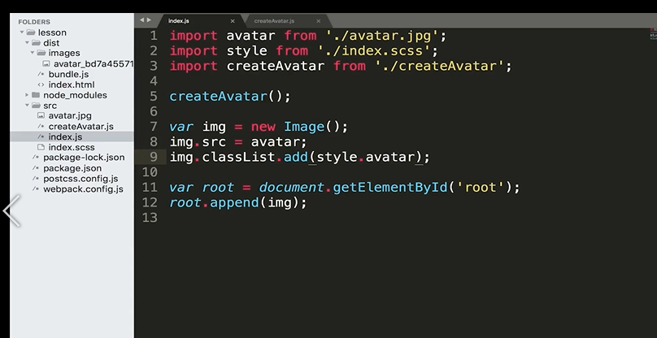
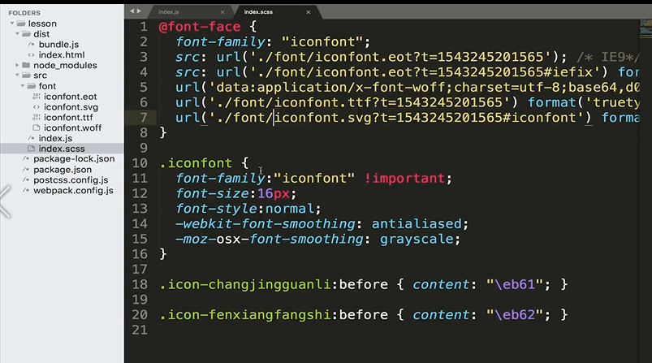

# webpack

## webpack是什么？

webpack是一个模块打包工具（*webpack* is a module bundler.）。

## 安装

1. 初始化，生成package.json文件。

   ```bash
   npm init -y
   ```

2. 要安装最新版本或特定版本。

   ```bash
   npm install --save-dev webpack
   npm install --save-dev webpack@<version>
   yarn add webpack@4.25.1 --dev
   ```

3. 如果你使用 webpack 4+ 版本，你还需要安装 CLI，webpack-cli作用是为了保证我们能够正确运行webpack命令。

   ```bash
   npm install --save-dev webpack-cli
   yarn add webpack-cli --dev
   ```

   对于大多数项目，建议本地安装。这可以使我们在引入破坏式变更(breaking change)的依赖时，更容易分别升级项目。通常，webpack 通过运行一个或多个 [npm scripts](https://docs.npmjs.com/misc/scripts)，会在本地 `node_modules` 目录中查找安装的 webpack：

   ```js
   "scripts": {
       "start": "webpack --config webpack.config.js"
   }
   ```

4. 查看本地安装是否成功：查看版本号。

   ```bash
   npx webpack -v
   yarn webpack -v
   ```

   通过以上的方式是通过在node_modules文件夹下运行该命令。

   

## webpack.config.js

webpack的配置文件webpack.config.js。

创建`webpack.config.js`文件。

```js
const path = require('path');
module.exports = {
    //入口文件
    mode:'production',
    //mode:'development'  //打包的文件不会被压缩
    // entry:'./index.js',
    entry:{
        main:'./src/index.js'
    }
    output:{
        //打包后的文件名
        filename: 'bundle.js',
        //指定存为位置
        path: path.resolve(__dirname,'dist')
    }
}
```

如何以其它文件作为配置文件来进行打包？

```bash
npx webpack --config webpackconfig.js
```

在package.json文件中指定进行打包的命令：

```js
{
  "scripts": {
    "build":"webpack --config webpack.config.js"
  }
}
```

scripts中的命令会首先在node_modules文件夹下运行该命令,如果没有就会在全局运行。

然后执行一下命令就可以进行打包：

```js
npm run build
```

## loader

### loader是什么?

webpack可以使用loader来预处理文件。这允许打包除 JavaScript 之外的任何静态资源。可以使用 Node.js 来很简单地编写自己的 loader。

需要打包某个文件就安装某个对应的[loader](https://www.webpackjs.com/loaders/)。

```bash
npm install --save-dev file-loader
```

**webpack.config.js**

```js
module.exports = {
  module: {
    rules: [
      {
        test: /\.(png|jpg|gif)$/,
        use: [
          {
            loader: 'file-loader',
            options: {}
          }
        ]
      }
    ]
  }
}
```

生成文件 file.png，输出到输出目录并返回 public URL。

```
"/public/path/0dcbbaa7013869e351f.png"
```

### 使用loader打包静态资源(图片)

#### file-loader

```js
module.exports = {
    //入口文件
    mode:'production',
    //mode:'development'  //打包的文件不会被压缩
    // entry:'./index.js',
    entry:{
         main:'./src/index.js'
    },
    output:{
        //打包后的文件名
        filename: 'bundle.js',
        //指定存为位置
        path: path.resolve(__dirname,'dist')
    },
    module: {
      rules: [
        {
          test: /\.(png|jpg|gif)$/,
          use: [
            {
              loader: 'file-loader',
              options: {
                  name:'[name].[ext]',//名字+后缀
                // name:'[name]_[hash].[ext]'//名字_hash值+后缀
                // name:'[hash].[ext]'//hash值+后缀
              }
            }
          ]
        }
      ]
    }
  }
```

#### url-loader

会把图片转化成Base64的Url。（A loader for webpack which transforms files into base64 URIs.）

如果图片过大，就会造成页面显示出来的时间很慢。但是`url-loader`有利于我们打包图片小的资源，减少了HTTP的请求次数。可以通过options中的limit来限制应该打包的对象的大小。

```js
module.exports = {
        //入口文件
    mode:'production',
    //mode:'development'  //打包的文件不会被压缩
    // entry:'./index.js',
    entry:{
         main:'./src/index.js'
    },
    output:{
        //打包后的文件名
        filename: 'bundle.js',
        //指定存为位置
        path: path.resolve(__dirname,'dist')
    },
  module: {
    rules: [
      {
        test: /\.(png|jpg|gif)$/,
        use: [
          {
            loader: 'url-loader',
            options: {
               name:'[name]_[hash].[ext]',
               outputPath:'img/'
               limit:2048 //2048个字节的大小。(约2kb)
            }
          }
        ]
      }
    ]
  }
}
```

当大于limit的值时，会将图片打包到`dist/img`目录下。当小于limit的值时，会转化成Base64的值。


### 使用loader打包静态资源（样式）

The `css-loader` interprets `@import` and `url()` like `import/require()` and will resolve them.

对css文件进行打包，它需要`css-loader`和`style-loader`。

`webpack.config.js`

```js
module.exports = {
  module: {
    rules: [
      {
        test: /\.css$/i,
        use: ['style-loader', 'css-loader'],
      },
    ],
  },
};
```

**css-loader作用**

会帮助我们分析出几个css文件的关系，最终把css文件合并成一段css。例如index.css引入avatar.css.

```css
css@import './avatar.css'
```


**style-loader作用**

在得到css-loader生成的内容后，会把css-loader生成的内容挂载在html中的head标签里。

#### sass-loader

如果用的是sass或者less这些预处理器，那怎么进行转化处理呢？

这时候就需要引入相对应的转化loader,这里以sass为例，使用`sass-loader`。

```console
npm install sass-loader node-sass  --save-dev

yarn add sass-loader node-sass --dev
```

`webpack.config.js`

```js
module.exports = {
  module: {
    rules: [
      {
        test: /\.s[ac]ss$/i,
        use: [
          // Creates `style` nodes from JS strings
          'style-loader',
          // Translates CSS into CommonJS
          'css-loader',
          // Compiles Sass to CSS
          'sass-loader',
        ],
      },
    ],
  },
};
```

loader的执行是有顺序的，它是从下往上，从右往左的执行顺序。

#### postcss-loader

如何自动添加厂商前缀:使用`postcss-loader`中的插件`autoprefixer`

```bash
npm i -D postcss-loader
```

需要做如下配置：

`postcss.config.js`

```js
module.exports = {
    parser: 'sugarss',
    plugins: {
      'postcss-import': {},
      'postcss-preset-env': {},
      'cssnano': {},
      'autoprefixer':{}
    }
}
```

`webpack.config.js`

```js
module.exports = {
  module: {
    rules: [
      {
        test: /\.s[ac]ss$/i,
        use: [
          // Creates `style` nodes from JS strings
          'style-loader',
          // Translates CSS into CommonJS
          'css-loader',
          // Compiles Sass to CSS
          'sass-loader',
          'postcss-loader'
        ],
      },
    ],
  },
};
```

#### importLoaders

查询参数 `importLoaders`，用于配置「`css-loader` 作用于 `@import` 的资源之前」有多少个 loader。

**webpack.config.js**

```js
{
  test: /\.css$/,
  use: [
    'style-loader',
    {
      loader: 'css-loader',
      options: {
        importLoaders: 2 // 0 => 无 loader(默认); 1 => postcss-loader; 2 => postcss-loader, sass-loader
      }
    },
    'postcss-loader',
    'sass-loader'
  ]
}
```

在模块系统（即 webpack）支持原始 loader 匹配后，此功能可能在将来会发生变化。

#### css modules

开启css的模块化打包：避免样式冲突。

`webpack.config.js`

```js
{
  test: /\.css$/,
  use: [
    'style-loader',
    {
      loader: 'css-loader',
      options: {
        importLoaders: 2,
        modules: true //开启模块化打包
      }
    },
    'postcss-loader',
    'sass-loader'
  ]
}
```




#### 打包字体文件



因为在该文件中引入了字体文件，所以在打包的时候会报错。那么如何对其进行打包呢？

安装file-loader 。 

`webpack.config.js`

```js
module.exports = {
    //入口文件
    mode:'production',
    //mode:'development'  //打包的文件不会被压缩
    // entry:'./index.js',
    entry:{
         main:'./src/index.js'
    },
    output:{
        //打包后的文件名
        filename: 'bundle.js',
        //指定存为位置
        path: path.resolve(__dirname,'dist')
    },
    module: {
      rules: [
        {
          test: /\.(eot|ttf|svg)$/,
          use: 
            {
              loader: 'file-loader',
            }
        },
      ]
    }
  }
```


#### imports-loader

```js
npm install imports-loader -D

yarn add imports-loader --dev
```

模块中的this一般都指向当前自己模块。如何改变模块的this指向window？

```js
module: {
    rules: [
      { 
        test: /\.js$/, 
        exclude: /node_modules/,
         use:[
           {
           loader: "babel-loader"
           },
           {
            loader: "imports-loader?this=>window"
           }
        ] 
      },
     ]
}
```

[impots-loader]( https://webpack.js.org/loaders/imports-loader/ )


## 插件

插件可以在webpack运行到某个时刻的时候，帮你做一些事情。

### HtmlWebpackPlugin

会在打包结束后，自动生成一个html文件，并把打包生成的js自动引入到这个html文件中。

```bash
npm install --save-dev html-webpack-plugin
```

`webpack.config.js`

```js
const HtmlWebpackPlugin = require('html-webpack-plugin');
const path = require('path')
module.exports = {
    //入口文件
    mode:'production',
    //mode:'development'  //打包的文件不会被压缩
    // entry:'./index.js',
    entry:{
         main:'./src/index.js'
    },
    plugins:[new HtmlWebpackPlugin({
      template:'src/index.html'//以某个html文件为模板生成。
    })],
    output:{
        //打包后的文件名
        filename: 'bundle.js',
        //指定存为位置
        path: path.resolve(__dirname,'dist')
    }
  }
```


### clean-webpack-plugin

 https://github.com/johnagan/clean-webpack-plugin 

可以帮助我们在下次打包之前清除上一次打包的内容。

```bash
npm install clean-webpack-plugin -D
```

webpack.config.js

```js
const HtmlWebpackPlugin = require('html-webpack-plugin');
const CleanWebpackPlugin = require('clean-webpack-plugin')
const path = require('path')
module.exports = {
    //入口文件
    mode:'production',
    //mode:'development'  //打包的文件不会被压缩
    // entry:'./index.js',
    entry:{
         main:'./src/index.js'
    },
    plugins:[
        new HtmlWebpackPlugin({
      	template:'src/index.html'//以某个html文件为模板生成。
    }),
        //new CleanWebpackPlugin(['dist']),//错误写法
        new CleanWebpackPlugin()
    ],
    output:{
        //打包后的文件名
        filename: 'bundle.js',
        //指定存为位置
        path: path.resolve(__dirname,'dist')
    }
  }
```

#### 错误举例


本来我是想引入这个插件，自动删除webpack里的dist目录。
配置文件写的如下：

```csharp
plugins:[new CleanWebpackPlugin(['dist'])
```

可是这样一直报错，查找了一些原因，后来发现是因为传参的原因导致的错误。
这样写就不会报错了

```cpp
plugins:[new CleanWebpackPlugin()],
```

可是不传参的话，他怎么知道我要删除的是哪个文件？看了官方介绍才知道，要删除的正是output.path！我的output配置项里的路径就是dist目录。

> By default, this plugin will remove all files inside webpack's **output.path** directory, as well as all unused webpack assets after every successful rebuild

```css
output:{
        filename:'bundle.js',
        path:path.resolve(__dirname,'dist')
    }
```


## Entry与Output的基础配置

`webpack.config.js`

```js
const path = require('path');
module.exports = {
    //入口文件
    mode:'production',
    //mode:'development'  //打包的文件不会被压缩
    // entry:'./index.js',
    entry:{
        //打包文件生成两个文件。
        main:'./src/index.js',
        sub: './src/index.js'
    }
    output:{
    	//静态资源放在cdn上时需要在入口文件将cdn地址加入进去。
        publicPath:'http://cdn.com.cn'
        //打包后的文件名,默认打包生成的文件是main.js
    //这里的name对应entry的key值
        filename: '[name].js',
        //指定存为位置
        path: path.resolve(__dirname,'dist')
    }
}
```


## SourceMap配置(devtool)

有利于查看错误位置。

|[资料](https://www.webpackjs.com/configuration/devtool/#devtool)|

举例子：现在知道dist目录下main.js文件96行出错。

sourceMap它是一个映射关系，他知道dist目录下main.js文件96行实际对应的是src目录下index.js文件中的第一行。

作用：当代码有错误时，我们希望看到的是源代码位置中的错误，而不是打包后文件错误的位置。

设置[devtool](https://webpack.js.org/configuration/devtool/)为source-map。运行打包后会生成一个相对应的映射文件：bundle.js.map

`webpack.config.js`

```js
const path = require('path');
module.exports = {
    //入口文件
    mode:'production',
    
    devtool:'source-map',
    //mode:'development'  //打包的文件不会被压缩
    // entry:'./index.js',
    entry:{
        main:'./src/index.js'
    }
    output:{
        //打包后的文件名
        filename: 'bundle.js',
        //指定存为位置
        path: path.resolve(__dirname,'dist')
    }
}
```

使用`inline-source-map`模式时不会生成映射文件，而是把对应的map文件放在了打包文件中。


推荐使用


mode为`development`模式(开发模式)时使用：

```js
devtool:'cheap-module-eval-source-map'
```

mode为`production`（生产模式）时使用：

```js
devtool:'cheap-module-source-map'
```

mode为`none`


##  --save-dev  --save的区别

**devDependencies**：是开发需要依赖的模块，在发布到生产环境时可以将其去掉的模块，诸如dev-tools,dev-server和jshint校验等。利用命令  `npm install xxx --save-dev `或`yarn add xxx --dev`会自动写入package.json文件的devDependencies对象里去。

 **dependencies**：是生产环境中需要依赖的模块。而使用  `npm install xxx --save`或`yarn add xxx` 安装的插件，会被写入到 dependencies 对象里面去。

 **scripts**：是给命令取了个别名，对于比较复杂的命令时很方便。  如运行`npm run dev`等效于webpack-dev-server --devtool eval --progress --colors --hot --inline --content-base ./build。


## webpackDevServer提升开发效率

由于之前的开发用的postcss等语法都需要`npm run build`或`yarn build`进行打包后，再打开对应的index.html查看效果，这造成了开发效率很低。


[在命令行中使用webpack](https://webpack.js.org/api/cli/).

**为了提高开发效率，那么怎么做呢？**

### 方法1：通过修改`package.json`中的启动命令

```js
"scripts": {
    "watch": "webpack --watch"
}
//"scripts": {
//    "watch": "webpack --config webpack.config.js --watch"
//}
```

当文件进行修改保存后，在pakage.json中进行监听并进行自动的打包处理。但是，这个需要自己手动的刷新页面。

那么如何实现文件修改保存后，自动打包，自动刷新页面等更酷炫的操作呢？

通过webpackDevServer的方式实现。

### 方法2：webpackDevServer

参考资料：[devServer](https://webpack.js.org/configuration/dev-server/)

通过webpack的devServer的方式来实现。

1. 安装webpackDevServer

   ```bash
   npm install webpack-dev-server -D
   
   yarn add webpack-dev-server --dev
   ```

2. 在`webpack.config.js`中配置：

   ```js
    devServer:{
         //指定根路径（挂载在服务器上的目录）
         contentBase: '/dist',
         //在启动webpck-dever-sever时，会自动的打开浏览器
         open: true,
         //配置端口，默认为8080
         port: 3000
       }
   ```

3. 在`pacage.json`中配置启动方式。

   ```js
   "scripts": {
       "start": "webpack-dev-server"
   }
   ```

​     通过这种方式还可以进行Ajax请求，而通过方法1手动的方式打开文件的方式是file协议，是不可以进行Ajax请求的。

​	注意：通过这种方式进行的打包不会生成dist目录，而是将打包的文件放在了电脑中的内存里面，可以提高开发效率。

### proxy

`webpack.config.js`

```js
  devServer:{
      //指定根路径
      contentBase: '/dist',
      //在启动webpck-dever-sever时，会自动的打开浏览器
      open: true,
      port: 8080,
      proxy: {
        '/api': 'http://localhost:3000'
      }
    }
```

作用：如果用户访问`http://localhost:8080/api`这个地址的话会转发到`http://localhost:3000`这个地址，这样就可以进行跨域的配置。

那么如何自己去写一个服务器呢？

### 方法3：自己创建一个服务器

 使用node的express框架创建一个服务器，[在node中使用webpack](https://webpack.js.org/api/node/)。

1. 安装express

   ```bash
   npm install express -D
   
   yarn add express --dev
   ```

2. 安装webpack-dev-middleware中间件监听webpack文件的变化帮助你自动打包。

   ```bash
   npm install webpack-dev-middleware -D
   
   yarn add webpack-dev-middleware --dev
   ```

   ```bash
   yarn add express webpack-dev-middleware --dev
   ```

3. `webpack.config.js`中做修改。

   ```js
    output:{
        //所有打包文件的引用都加一个根路径/。确保文件路径不会有问题。
           publicPath: '/',
           //打包后的文件名
           filename: 'bundle.js',
           //指定存为位置
           path: path.resolve(__dirname,'dist')
       }
   ```

4. 在`package.json`中配置服务器启动命令。

   ```js
   "middleware": "node server.js"
   ```

5. 创建server.js,并编写相应的代码。

   ```js
   const express = require('express')
   const webpack = require('webpack')
   const webpackDevMiddleware = require('webpack-dev-middleware')
   const config = require("./webpack.config.js")
   //用webpack结合这个配置文件可以进行代码的编译。会返回一个编译器。
   const complier = webpack(config)
   
   const app = express()
   
   //启用中间件webpackDevMiddleware,
   //该中间件的作用是：只要文件发生改变了，就会运行complier进行重新编译，并将重新编译打包的文件输出到publicPath下
   app.use(webpackDevMiddleware(complier,{
       publicPath:config.output.publicPath
   }))
   
   
   app.listen(3000,()=>{
       console.log('server is running')
   })
   ```

   通过这种方式也需要自己手动刷新。

   
   
   
   
## Hot Module Replacement(模块热替换)

 

  简称： HMR

   它允许在运行时更新各种模块，而无需进行完全刷新。

   `webpack.config.js`

   ```js
   const HtmlWebpackPlugin = require('html-webpack-plugin');
   const path = require('path')
   const webpack = require('webpack')
   
   module.exports = {
       //入口文件
       entry:{
            main:'./src/index.js'
       },
       devServer:{
         //指定根路径
         contentBase: '/dist',
         //在启动webpck-dever-sever时，会自动的打开浏览器
         open: true,
         //开启hot module Replacement
         hot: true,
         //html失效时，不需要重新刷新页面
         hotOnly: true
       },
       plugins:[
         new HtmlWebpackPlugin({
         template:'src/index.html'
         }),
         //当开启 HMR 的时候使用该插件会显示模块的相对路径，建议用于开发环境
         new webpack.NamedModulesPlugin(),
         new webpack.HotModuleReplacementPlugin()
     ],
       output:{
           publicPath: '/',
           //打包后的文件名
           filename: 'bundle.js',
           //指定存为位置
           path: path.resolve(__dirname,'dist')
       },
       module: {
         rules: [
           {
             test: /\.css$/,
             use: [
               {
                 loader:'style-loader',
               },
               {
                 loader: 'css-loader',
                 options: {
                   importLoaders: 1,
                   modules: true //开启模块化打包
                 }
               },
              {
                loader:'postcss-loader'
              }  
             ]
           }
         ]
       }
     }
   ```

### 作用

**如果一个模块发生了变化，而另一个模块没有发生变化，那么当只想更新变化的模块，怎么做呢？**

### 例子

首先创建两个引用函数（模块）：

`counter.js`它可以在页面通过点击数字实现数字++功能。

```js
function counter() {
    let div = document.createElement('div')
    div.innerHTML = 1
    div.setAttribute('id','counter')

    div.onclick = function() {
        div.innerHTML = parseInt(div.innerHTML,10) +1
    }
    document.body.appendChild(div)
}

export default counter
```

`number.js`

```js
function number() {
    let div = document.createElement('div')
    div.setAttribute('id','number')
    div.innerHTML = 2000
    document.body.appendChild(div)
}

export default number;
```


入口文件`index.js`引入`number.js`和`counter.js`

`index.js`

```js
import number from './number'
import counter from './counter'

counter()
number()

//如果一个模块发生了变化，而另一个模块没有发生变化，那么只想更新变化的模块，怎么做呢？
if(module.hot) {
    //监控模块的变化
    module.hot.accept('./number',()=>{
        document.body.removeChild( document.getElementById('number'))
        number()
    })
}
```

当在页面进行点击按钮进行加加功能时（counter.js），从1加到一个固定的数字10，如下页面。


当在代码中的`number.js`（模块）的数字发生改变（如：手动改成1000）时，页面中应该也相应的发生变化

变成1000，但是页面中的模块`counter.js`不应该重置为1，而是保持10这个数字。通过` module.hot.accept`可以实现如上所述功能。呈现效果图如下：


css的改变也应该实现如上类似的功能，当css代码部分发生改变时，只更新css改变对应部分的模块，而其他模块不应该发生改变。这该如何实现呢？

其实`css-loader`已经帮助我们实现了上述的功能，不需要我们自己再通过` module.hot.accept`的方式再去实现。（注意：通过webpackDevServer运行的服务器下打包压缩的文件是存放在电脑内存里的，它不会生成dist目录，用postcss-cssnext语法写的css因为需要webpack打包，这种情况需要刷新页面才能有效果。）

### 参考资料

-  [Hot Module Replacement]([https://www.webpackjs.com/guides/hot-module-replacement/#hmr-%E4%BF%AE%E6%94%B9%E6%A0%B7%E5%BC%8F%E8%A1%A8](https://www.webpackjs.com/guides/hot-module-replacement/#hmr-修改样式表))

## babel配置

使用Babel处理ES6语法。

### webpack的方式

```js
npm install --save-dev babel-loader @babel/core
```

babel-loader:帮助webpack做打包的一个工具。

babel/core：是babel的一个核心库，能够让babel识别js中的内容，然后把这个js代码转化

成ast抽象语法树，再将ast抽象语法树编译转化成新的语法出来。只要知道babel/core是babel的一个核心库就行。

`webpack.config.js`做配置

```js
module: {
  rules: [
    { 
        test: /\.js$/, 
    	//node_modules实际是第三发代码，没必要对其进行babel转化，将其排除在外。    
        exclude: /node_modules/, 
        loader: "babel-loader" 
    }
  ]
}
```

babel-loader只是webpack与balbe做通信的桥梁，实际上并不会帮助你对js代码里面的ES6语法翻译成ES5的语法，还需要其他的模块对其进行翻译，这里需要@babel/preset-env模块。

```bash
npm install @babel/preset-env --save-dev
```

@babel/preset-env包含了所有ES6翻译成ES5的翻译规则。

然后对`webpack.config.js`添加optios

```js
module: {
  rules: [
    { 
        test: /\.js$/, 
    	//node_modules实际是第三发代码，没必要对其进行babel转化，将其排除在外。    
        exclude: /node_modules/, 
        loader: "babel-loader",
        options: {
            "presets": ["@babel/preset-env"]
        }
    }
  ]
}
```

通过以上的方式可以对其进行了翻译，但是对于一些低版本的浏览器里还是不支持一部分语法，列入Promise,map这些没被翻译。还需要对这一部分缺失的翻译补充进去，这时需要@babel/polyfill这个模块来进行补充。

```bash
npm install --save @babel/polyfill

yarn add @babel/polyfill
```

这时只需要在所有代码运行之前引入就可以解决：

```js
require("@babel/polyfill");
或者：
import "@babel/polyfill";
```

在未引入`@babel/polyfill`,运行`yarn build`命令进行打包：


在引入`@babel/polyfill`之后，运行`yarn build`命令进行打包后：


引入`@babel/polyfill`之后发现打包的文件大小变大了，这是因为它需要弥补低版本浏览器不存在的内容，它对所有未使用的语法也进行了实现，这显然不是我们想要的结果，我们只想对我们引入使用的语法做实现即可。如何实现呢？

对@babel/preset-env做配置:将"useBuiltIns"设置为"usage"。

```js
     { 
          test: /\.js$/, 
          //node_modules实际是第三发代码，没必要对其进行babel转化，将其排除在外。
          exclude: /node_modules/,
           loader: "babel-loader" ,
           options: {
             "presets": [
               ["@babel/preset-env",{
                "useBuiltIns": "usage"
             }]
            ]
           }
        }
```

然后再运行打包`yarn build`：


这时大小就会精简了很多。

还可以通过指定浏览器版本(因为我们有时候不需要对其他低版本浏览器做兼容，这时可以通过这种方式来解决):

```js
   { 
          test: /\.js$/, 
          //node_modules实际是第三发代码，没必要对其进行babel转化，将其排除在外。
          exclude: /node_modules/,
           loader: "babel-loader" ,
           options: {
             "presets": [
               ["@babel/preset-env",
                {
                  "targets": {
                    "chrome": "67"                 
                  },             
                "useBuiltIns": "usage"
              }
              ]
            ]
           }
    }
```

通过打包后：


`import @babel/polyfill`适用于业务场景代码。

通过`import "@babel/polyfill";`这种方式在开发类库或者开发第三方模块或UI组件库时，引入会污染全局环境。这种场景如何解决呢？

可以通过transform-runtimel来解决。

### [transform-runtime](https://babel.docschina.org/docs/en/babel-plugin-transform-runtime)

通过这种方式解决了`@babel/polyfill`污染全局环境的问题，使用它是更为合理的一种方式。

安装插件

```bash
npm install --save-dev @babel/plugin-transform-runtime

yarn add @babel/plugin-transform-runtime --dev
```

还需安装@babel/runtime：

```bash
npm install --save @babel/runtime

yarn add @babel/runtime
```

还需安装：

```bash
npm install --save @babel/runtime-corejs2

yarn add @babel/runtime-corejs2
```

`webpack.config.js`

```js
      { 
          test: /\.js$/, 
          exclude: /node_modules/,
           loader: "babel-loader" ,
           options: {
            "plugins": [["@babel/plugin-transform-runtime",{
              "corejs": 2,
              "helpers": true,
              "regenerator": true,
              "useESModules": false
            }]]
           }
        },
```


综上：从上面的可以看出在webpack.config.js中的babel配置内容是非常多的，那么如何解决这种问题，可以通过创建一个`.babelrc`文件，将bable的配置项放入该文件中即可。

### .babelrc

`.babelrc`

```js
{
    "plugins": [
        ["@babel/plugin-transform-runtime",{
            "corejs": 2,
            "helpers": true,
            "regenerator": true,
            "useESModules": false
         }
        ]
    ]
}
```

或者：

```js
module.exports = {
  "plugins": [
    [
      "@babel/plugin-transform-runtime",
      {
        "corejs": 2,
        "helpers": true,
        "regenerator": true,
        "useESModules": false
      }
    ]
  ]
}
```

在`webpack.config.js`中只需引入babel-loader。

```js
  { 
    test: /\.js$/, 
    exclude: /node_modules/,
    loader: "babel-loader" 
 }
```

### babel.config.js与.babelrc的区别？

- babel.config.js <br>
Babel7.x新特性，项目全局配置
默认使用当前工作目录下的babel.config.js文件，可配置configFile覆盖默认文件路径

1. 对当前工作目录下 node_modules 或 symlinked packages 均可生效
2. 当前工作目录下如果配置了.babelrc，其中配置将会覆盖或合并babel.config.js中的配置.
3. 如果在工作目录下某个子文件的 package中运行babel，将无法找到根目录的babel.config.js文件 （可以配置 "rootMode" 选项为 "upward"，让Babel自动向上寻找）

- .babelrc <br>
File-relative configuration
与文件实际物理位置相关
1. 从编译文件向上查找文件系统获取.babelrc文件，找到package.json为止
2. 如果目录不在 babelrcRoots 配置中（默认配置为. 即根目录），.babelrc文件将被忽略

### 参考资料

- [.babelrc与babel.config.js的区别](https://www.jianshu.com/p/faad8917b8e9)
- [资料](https://babel.docschina.org/setup#installation)


## 配置React代码的打包

首先需要安装Reatc:

```bash
npm install react react-dom --save

yarn add react react-dom
```

但是在安装后运行仍然不行，这时需要安装`@babel/preset-react`来帮助我们解析jsx语法：

安装

```js
npm install --save-dev @babel/preset-react

yarn add @babel/preset-react --dev
```

`.babelrc`中做配置：

```js
{
    "presets": [
        [
            "@babel/preset-env",{
             "targets": {
             "chrome": "67"                 
            },             
            "useBuiltIns": "usage"
            }
        ],
        "@babel/preset-react"
     ]
}
```

presets的执行是有顺序的，它是从下往上，从右往左的顺序执行。

这时候配置就成功了。

### 参考资料

[prent-react](https://babel.docschina.org/docs/en/babel-preset-react)